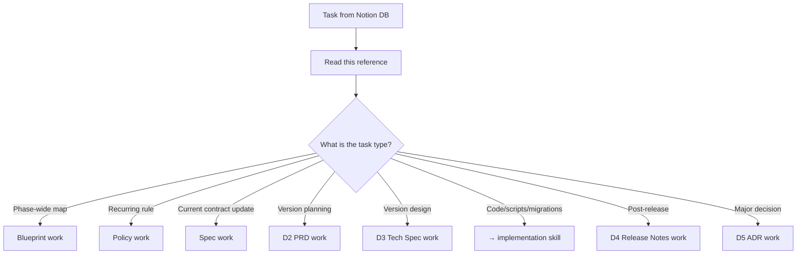
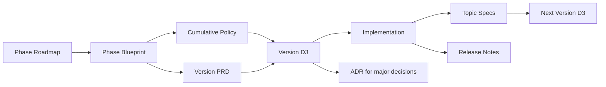

# Documentation Workflow Reference

Source SSOT: [제품 문서화 가이드 — 문서 체계와 작성 스킬](https://www.notion.so/ada346dac45682dca9f001cfff8ae0fc)

Use with **youpd-documentation-workflow** when the primary deliverable is a Notion document. For **small Spec/Policy patches** tied to a single implementation PR, use **youpd-implementation-workflow** Close-out instead.

## Core Principle

Documents have different lifetimes and purposes:

| Document | Lifetime | Role |
|---|---|---|
| **Blueprint** | Phase duration | Phase-wide route map, domain model, milestone plan — not an implementation contract |
| **Policy** | Cumulative | Rules that persist across versions (migration policy, naming, BYOK, error codes) |
| **Spec** | Living / topic-based | Current implementation contract (DB schema, data model, route/CLI contract) |
| **D2 PRD** | Frozen at release | Why and what for this version — user value and scope |
| **D3 Tech Spec** | Frozen at release | What to implement this version — data model, API, algorithms, verification |
| **D4 Release Notes** | Cumulative | What actually shipped vs plan |
| **D5 ADR** | Immutable | One major decision record |

**SSOT rule:** When information overlaps, the longest-lived document wins — D1 for product principles, Blueprint for phase map, Policy for recurring rules, topic Spec for current implementation contracts.

## Spec routing (youpd-skills)

| Situation | Skill |
|---|---|
| Dedicated Spec task or large contract restructure | **youpd-documentation-workflow** (this reference, Topic Spec section) |
| Small Spec/Policy update after implementation (one area, one PR) | **youpd-implementation-workflow** Close-out |

## Decision Flow

### Quick classification cues

| Task signal | Work type | Do not confuse with |
|---|---|---|
| "기획안", "PRD", user value / scope for one version | **D2 PRD** | D3 (implementation detail), Spec (current contract) |
| "설계문서", "D3", "Tech Spec", schema/API for one version | **D3 Tech Spec** | Blueprint (phase-wide), Spec (already shipped contract) |
| "스펙", "Spec", "현재 구현 계약", "스키마 최신화" (dedicated task) | **Topic Spec** | D3 (version intent), PRD (user value) |
| "개발", "구현", "implementation", script/migration work | **Implementation** | PRD/D3 drafting |
| "Blueprint", "Phase roadmap", milestone cut plan | **Blueprint** | Version D3 |
| "정책", "Policy", repeated rule across versions | **Policy** | ADR (one-time decision) |

## Dependency Order

### Preconditions by work type

| Work type | Can start when |
|---|---|
| **Blueprint** | Phase roadmap or product overview exists |
| **Policy** | Recurring rule identified (often from Blueprint or repeated D3 content) |
| **D2 PRD** | Phase roadmap/Blueprint exists or user explicitly requests drafting roadmap first |
| **D3 Tech Spec** | Version PRD complete or accepted; relevant Policy/Blueprint read |
| **Implementation** | Roadmap, PRD, and D3 complete or explicitly accepted |
| **Topic Spec** | Relevant code/migrations/references/tests exist or changed |
| **D4 Release Notes** | Version implementation shipped |
| **D5 ADR** | Major decision made during PRD/D3/implementation |

## What To Do For Each Work Type

### D2 PRD (기획)

**Goal:** Define why and what for this version.

**Read first:** Phase roadmap/Blueprint, D1 product overview, prior version PRD/D4 if relevant.

**Produce:**
- User scenarios, triggers, natural-language reporting expectations
- In-scope / out-of-scope for this version
- Open questions deferred to D3

**Do not include:** DB field details, API contracts, migration SQL — send those to D3.

**Naming:** `{제품명} v0.X 기획안` (e.g. `youpd-skills P1.0 기획안 — DB 스키마 부트스트래핑`)

### D3 Tech Spec (설계)

**Goal:** Define what will actually be implemented this version.

**Read first:** Version PRD, Phase Blueprint, applicable Policy docs.

**Produce:**
- Data model, interfaces, algorithms, operational rules for this version only
- Verification plan (tests, smoke checks)
- Items pulled from Blueprint that belong in this version cut

**Do not include:** Phase-wide tables/APIs not in this version — keep in Blueprint. Recurring rules — extract to Policy.

**Naming:** `{제품명} v0.X 설계문서 — {주제}` (e.g. `youpd-skills P1.0 설계문서 — DB 스키마 부트스트래핑`)

### Topic Spec (스펙)

**Goal:** Document what the **current code** actually guarantees — a living contract, not version-scoped intent.

**Read first:** Current code on `main`, migrations, route references, tests, related Policy/Blueprint/D3.

**Produce:**
- **Current Contract** — tables, indexes, constraints, route I/O, error codes, env vars as implemented
- **Not Implemented / Planned** — Blueprint/D3 items not yet in code
- **Validation** — which tests/smoke checks enforce the contract
- **Change Log** — contract change history

**Naming:** `{제품명} 스펙 — {계약 영역}` (e.g. `youpd-skills 스펙 — DB 스키마`)

### Implementation (구현)

Not handled in this skill — use **youpd-implementation-workflow** and `AGENTS.md` implementation conventions.

### Blueprint / Policy / D4 / D5

| Type | When | Key output |
|---|---|---|
| **Blueprint** | Phase or large initiative start | Route map, domain model, version cut plan, open questions |
| **Policy** | Recurring rule emerges | Rules, exceptions, examples, related doc links |
| **D4 Release Notes** | After version ships | Shipped features, plan vs actual, known issues |
| **D5 ADR** | Major decision moment | Decision, alternatives, rationale — immutable; supersede with new ADR |

## Notion Task Database Mapping

| `작업 유형` (task DB) | Follow section |
|---|---|
| 상세 로드맵 작성 | Blueprint |
| PRD 작성 | D2 PRD |
| 설계 작성 | D3 Tech Spec |
| 구현 | → youpd-implementation-workflow |
| 검증 | → youpd-implementation-workflow (Close-out + optional youpd-reconciliation) |

Topic Spec, Policy, and ADR work usually has no dedicated `작업 유형`; classify by the document being produced.

Task status: `상태` = `대기` / `진행중` / `보류` / `완료` / `취소`. Only set `완료` when the user asked to update status.

## Notion Document Tags

| Work type (this reference) | `태그` to set | Page template (if any) |
|---|---|---|
| Blueprint | `제품 로드맵` | — |
| Policy | `정책` | — |
| D2 PRD | `PRD` | 신제품 스펙 문서(PRD) |
| D3 Tech Spec | `설계` | 신기술 스펙 문서 |
| Topic Spec | `스펙` | — |
| D4 Release Notes | `릴리즈 노트` | — |
| D5 ADR | `ADR` | — |
| Guide / runbook | `가이드` | — |
| Research / exploration | `리서치` | — |
| Reconciliation report | `리서치` | — |

**ADR lifecycle:** prefix `[ADR-NNNN]`; supersede with `Superseded by [ADR-MMMM]` line, do not rewrite body.

## Anti-Patterns

- Putting the entire phase DB schema in one version D3 → keep in Blueprint, cut per version in D3
- Copying recurring rules into every version D3 → extract to Policy
- Creating version-scoped Spec docs → Spec is topic-based and living
- Marking unimplemented Blueprint items as current Spec contracts → use Not Implemented / Planned
- Appending implementation results to PRD → use D4 or topic Spec
- Editing a shipped D3 retroactively → new version D3 or ADR
- Treating ADR as updatable policy → ADR is immutable; Policy is the living rule set

## youpd-skills Examples

| Document | Example link |
|---|---|
| Blueprint | [Phase 1 Technical Blueprint](https://www.notion.so/36d346dac456813daa20e054198e3a8c) |
| D2 PRD | [P1.0 기획안](https://www.notion.so/36c346dac45681379c4ef2d1df1226b4) |
| D3 Tech Spec | [P1.0 설계문서](https://www.notion.so/36d346dac45681faa27fdfb0b39ef9fe) |
| DB Schema Spec | [youpd-skills 스펙 — DB 스키마](https://www.notion.so/36c346dac45681a1923af41aa49c6a33) |
| Route Contract Spec | [youpd-skills 스펙 — Route / CLI 계약](https://www.notion.so/36d346dac45681e994aefccd54ff4487) |
